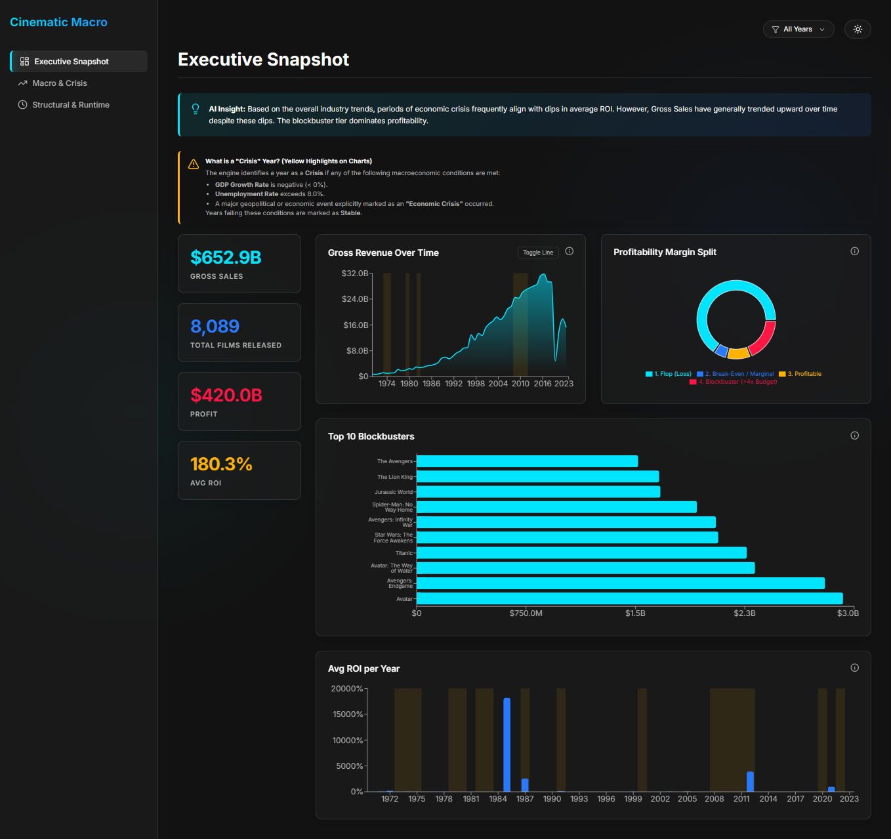
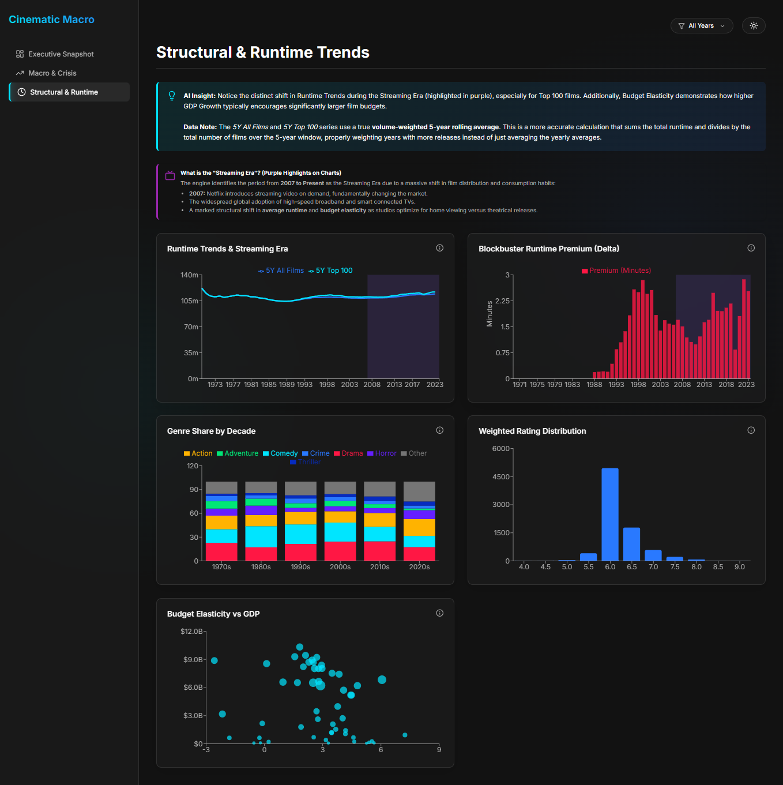
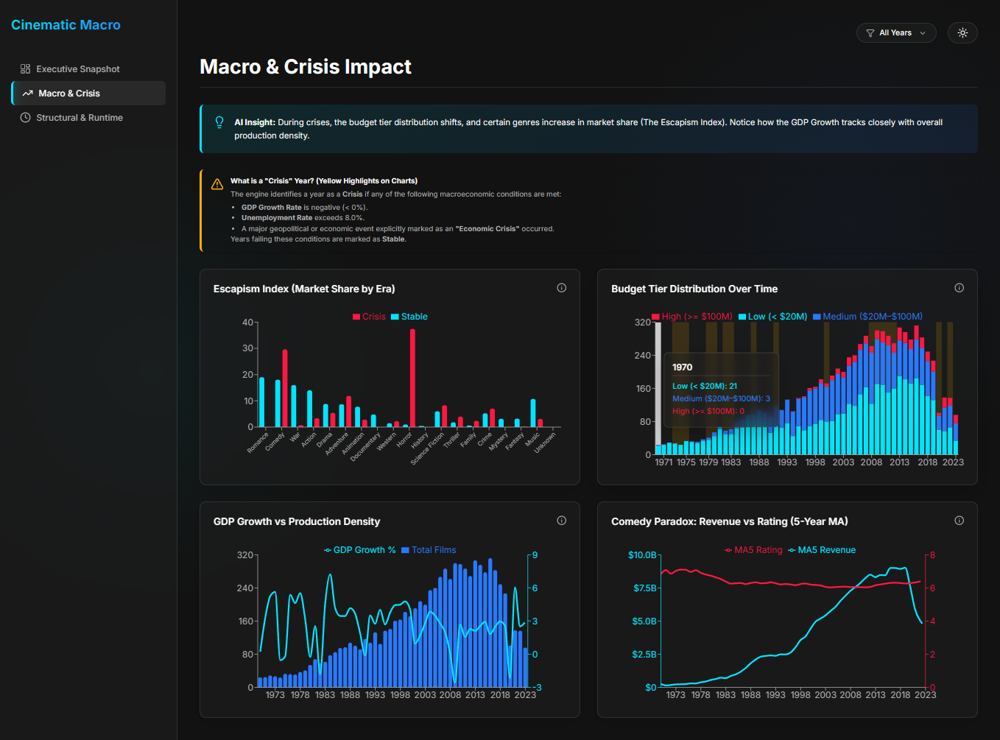

# The Cinematic Macro-Economic Engine
### *How Wealth, Crisis, and History Shape Human Consumer Behavior & Cinema Trends (1970 - 2024)*

---

## 📌 Project Overview
The **Cinematic Macro-Economic Engine** is an end-to-end data analytics platform designed to reverse-engineer human psychology through the lens of global box office trends and macroeconomic indicators. 

Instead of treating movie data as isolated metrics, this project establishes a **Socio-Economic & Cultural Analytics Engine**. It integrates fragmented datasets—including historical geopolitical events, technology adoption cycles (like the Streaming Era), and macro-economic factors (Inflation, Unemployment, GDP Growth)—to uncover non-obvious consumer behavioral insights.

---

## 📸 Dashboard Preview

### Executive Snapshot


### Structural & Runtime Trends


### Macro & Crisis Impact


---

## 🚀 Key Features & Analytics

The frontend provides an interactive, glassmorphic dashboard separated into three core analytical views:

1. **Executive Snapshot:** 
   - Tracks overarching Gross Revenue Over Time.
   - Highlights Profitability Margin Splits (how many films are true blockbusters vs flops).
   - Identifies the Top 10 Blockbusters and tracks Average Return on Investment across eras.
2. **Structural & Runtime Trends:** 
   - Maps the distinct shift in film runtimes correlating with the **Streaming Era** (2007-Present).
   - Showcases "Budget Elasticity" in response to global GDP growth rates.
   - Highlights Genre Share shifts across decades and overarching quality (IMDb rating) distributions.
3. **Macro & Crisis Impact:** 
   - **The Escapism Index:** Demonstrates how market share for specific genres shifts during periods of economic instability versus stability.
   - Tracks Production Density and Budget Tiers relative to GDP Growth.
   - **The Comedy Paradox:** Evaluates the divergence of comedy revenue and audience ratings over a 5-year moving average.

---

## 🛠️ Tech Stack & Infrastructure

This project has been modernized from a basic Streamlit script into a full-stack web application:

* **Frontend (UI/UX):** React, Vite, Recharts (for dynamic data visualization), Lucide-React (icons). Designed with a premium Glassmorphic aesthetic, responsive grid layouts, and custom interactive tooltips.
* **Backend API:** FastAPI (Python), serving RESTful endpoints for the frontend.
* **Data Processing & Analytics:** Python 3 (Pandas, SQLAlchemy).
* **Database Engine:** Flexible SQL backend (connected via SQLAlchemy, defaults to MySQL but compatible with PostgreSQL/SQLite via standard connection URIs).
* **Environment:** Configured using standard `.env` secrets for secure database connectivity.

---

## 📐 Architecture & Data Schema (Star Schema)

The analytical data warehouse follows robust dimensional modeling principles, using a **Star Schema** designed for maximum query efficiency and clear separation of concerns.

* **fact_box_office (The Core Engine):** Stores measurable quantitative data (Budget, Revenue, Calculated ROI, IMDb Ratings, Vote Counts).
* **dim_movies:** Metadata describing the product (Movie ID, Title, Genres, Runtime).
* **dim_macroeconomics:** Yearly economic snapshots (GDP Growth Rate, Inflation Rate, Unemployment Rate).
* **dim_geopolitical_events:** Maps years to specific socio-political climates.
* **dim_date:** Temporal dimension for decade-over-decade aggregations and timeline analysis.

---

## 📋 Prerequisites

Before you begin, ensure you have the following installed:
- **Python 3.9+**
- **Node.js (v18+)** & **npm**
- **SQL Database** (MySQL, PostgreSQL, or SQLite)

---

## ⚙️ Running Locally

1. **Backend:**
   Ensure you have your environment variables set in `.env` (e.g., `SQLALCHEMY_DATABASE_URI`).
   ```bash
   pip install -r requirements.txt
   uvicorn src.app:app --reload --port 8000
   ```

2. **Frontend:**
   ```bash
   cd frontend
   npm install
   npm run dev
   ```
   Navigate to `http://localhost:5173` to view the dashboard.
